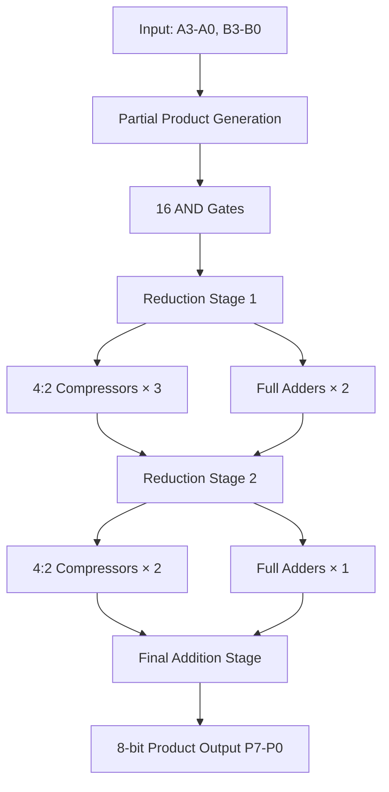
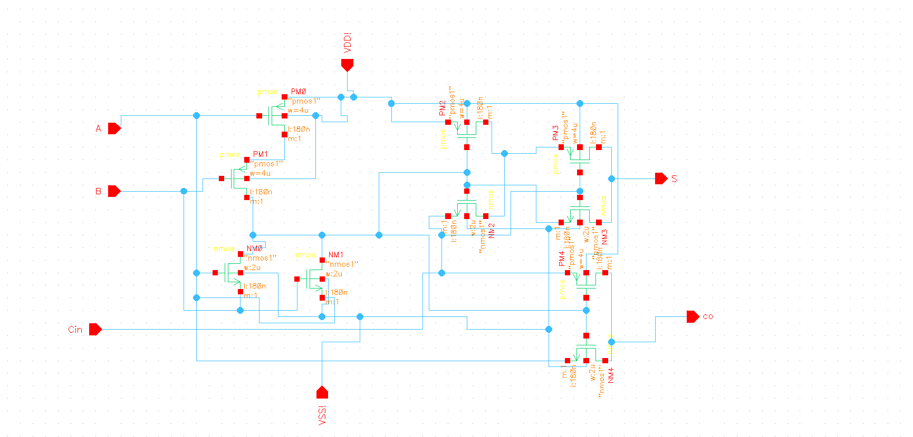
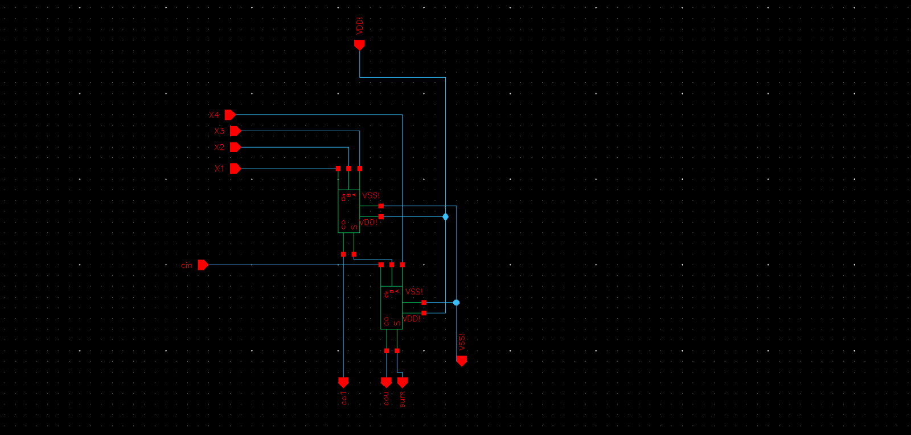
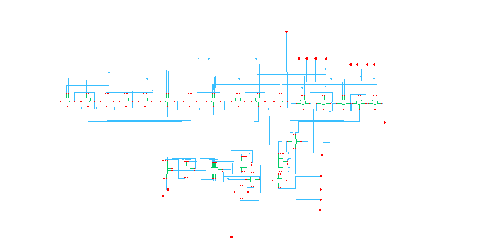
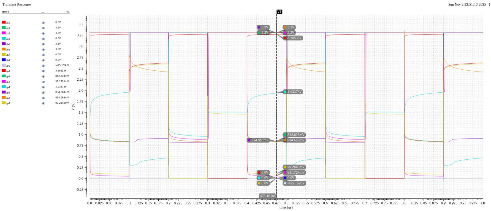
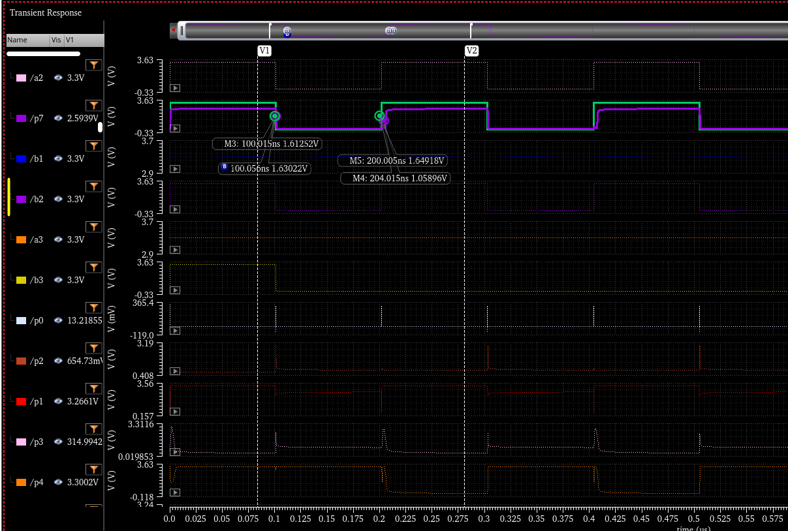
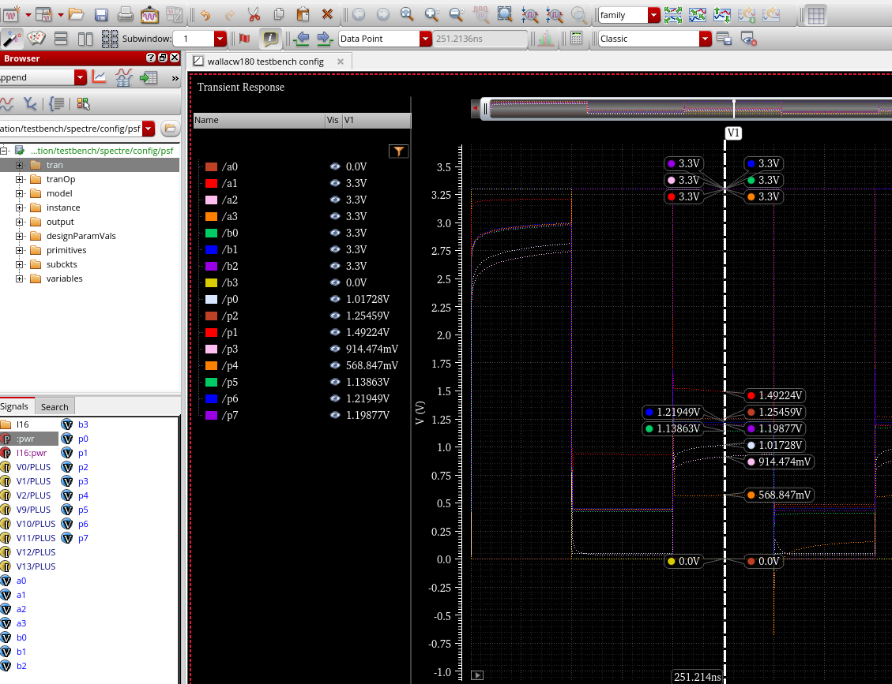
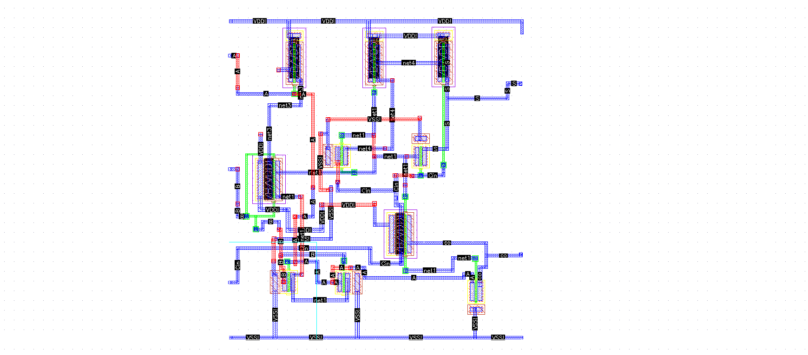
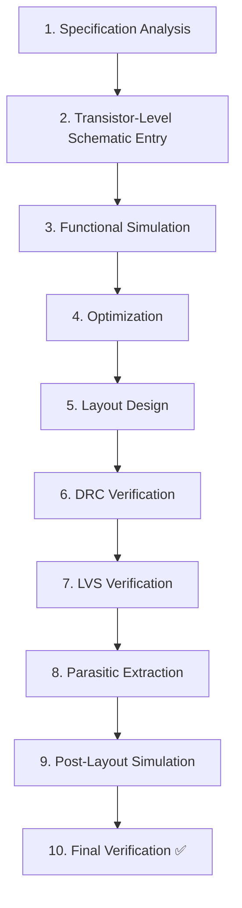

# 4-Bit Wallace Tree Multiplier Using High-Speed Low-Power Full Adder

<div align="center">


### Design and Implementation in Cadence Virtuoso (GPDK 180nm CMOS Technology)

*A complete full-custom transistor-level implementation of a high-performance 4-bit multiplier*

[Overview](#-overview) • [Highlights](#-project-highlights) • [Architecture](#%EF%B8%8F-design-architecture) • [Results](#-simulation-results) • [Layout](#-layout-design) • [Metrics](#-performance-metrics)

---

</div>

## 📋 Table of Contents

<details>
<summary>Click to expand</summary>

- [🎯 Overview](#-overview)
- [⚡ Project Highlights](#-project-highlights)
- [🏗️ Design Architecture](#%EF%B8%8F-design-architecture)
- [📐 Circuit Schematics](#-circuit-schematics)
- [📊 Simulation Results](#-simulation-results)
- [🔲 Layout Design](#-layout-design)
- [📈 Performance Metrics](#-performance-metrics)
- [✅ Design Verification](#-design-verification)
- [🎯 Applications](#-applications)
- [🛠️ Design Methodology](#%EF%B8%8F-design-methodology)
- [📝 Conclusion](#-conclusion)
- [👨‍💻 Author Information](#-author-information)
- [🙏 Acknowledgments](#-acknowledgments)
- [📚 References](#-references)
- [📄 License](#-license)

</details>

---

## 🎯 Overview

This project presents a **full-custom VLSI implementation** of a **4-bit Wallace Tree Multiplier** designed using **high-speed, low-power 10-Transistor (10T) Pass Transistor Logic Full Adders**. The design leverages hierarchical architecture with optimized 4:2 compressors and half adders to achieve efficient partial product reduction.

<div align="center">

| **Parameter** | **Specification** |
|:---:|:---:|
| **Design Tool** | Cadence Virtuoso Analog Design Environment |
| **Technology Node** | GPDK 180nm CMOS Process |
| **Supply Voltage** | 3.3V |
| **Design Approach** | Full-Custom Transistor-Level Implementation |

</div>

---

## ⚡ Project Highlights

<table>
<tr>
<td width="50%">

### 🚀 Performance Features
- ✅ **Custom 10T Full Adder** - Optimized using pass transistor logic and transmission gates
- ✅ **High-Speed Operation** - Average propagation delay ≈ 500 ps
- ✅ **Low Power Consumption** - Average power ≈ 63.36 µW per full adder

</td>
<td width="50%">

### 🔧 Design Excellence
- ✅ **4:2 Compressor Architecture** - Efficient partial product reduction
- ✅ **Complete Layout Implementation** - DRC and LVS verified
- ✅ **Comprehensive Simulation** - Transient, delay, and power analysis

</td>
</tr>
</table>

---

## 🏗️ Design Architecture

### 🔷 Wallace Tree Multiplier Structure

The 4-bit Wallace Tree Multiplier follows a **three-stage architecture**:


### 🔷 Component Hierarchy
```
📦 4-Bit Wallace Tree Multiplier
┃
┣━━ 🔧 Partial Product Generator (AND Gates)
┃
┣━━ 📐 Reduction Stage 1
┃   ┣━━ 4:2 Compressors (3 units)
┃   ┗━━ Full Adders (2 units)
┃
┗━━ 📐 Reduction Stage 2
    ┣━━ 4:2 Compressors (2 units)
    ┗━━ Full Adders (1 unit)
```

---

## 📐 Circuit Schematics

### 1️⃣ 10-Transistor Full Adder Schematic

<div align="center">

The core building block uses **pass transistor logic** with transmission gates for optimal speed-power tradeoff.

**⚙️ Transistor Sizing:**
| Type | Width | Ratio |
|:---:|:---:|:---:|
| NMOS | 2 µm | 1× |
| PMOS | 4 µm | 2× |


*Figure 1: 10T Full Adder Circuit Schematic - Cadence Virtuoso*

</div>

**🔑 Key Features:**
- Sum and Carry outputs generated using minimal transistor count
- Pass transistor network for reduced capacitance
- Transmission gates for bidirectional signal flow

---

### 2️⃣ 4:2 Compressor Schematic

<div align="center">

Constructed using two cascaded full adders with optimized interconnections.


*Figure 2: 4:2 Compressor Circuit using Two 10T Full Adders*

</div>

---

### 3️⃣ Complete Wallace Tree Multiplier Schematic

<div align="center">

The hierarchical integration of all components forming the complete 4-bit multiplier.


*Figure 3: Complete 4-Bit Wallace Tree Multiplier - Top Level Schematic*

</div>

---

## 📊 Simulation Results

### 🔬 Full Adder Transient Analysis

<div align="center">

**Test Conditions:**

| Parameter | Value |
|:---:|:---:|
| Supply Voltage | 3.3V |
| Input Rise/Fall Time | 10ps |
| Load Capacitance | 10fF |
| Temperature | 27°C |

</div>

<div align = "center">
    


*Figure 4: Full Adder Transient Response - Sum and Carry Outputs*


*Figure 5: Propagation Delay Measurement*

</div>

**⏱️ Propagation Delay Measurement (50% Crossing Method):**

| Measurement Point | Timing | Description |
|:---:|:---:|:---:|
| Input A @ 1.65V | 50.74735 ns | Input transition |
| Output S @ 1.65V | 50.85757 ns | Output transition |
| **t<sub>p</sub>** | **0.11 ns** | **Propagation Delay** |

---

### 🧮 Wallace Tree Multiplier Simulation

**✅ Multiplication Test Cases:**

<div align="center">

| A (4-bit) | B (4-bit) | Expected Product | Simulated Output | Status |
|:---:|:---:|:---:|:---:|:---:|
| 0011 (3) | 0010 (2) | 00000110 (6) | 00000110 (6) | ✅ Pass |
| 0101 (5) | 0100 (4) | 00010100 (20) | 00010100 (20) | ✅ Pass |
| 1111 (15) | 1111 (15) | 11100001 (225) | 11100001 (225) | ✅ Pass |
| 1010 (10) | 0110 (6) | 00111100 (60) | 00111100 (60) | ✅ Pass |

</div>

<div align="center">


*Figure 6: Wallace Tree Multiplier - Complete Transient Analysis*


*Figure 7: Detailed Riging & Falling Output Waveforms*


*Figure 8: Post-Layout Simulation Waveforms*

</div>

**⚡ Power Analysis:**
| Component | Power Consumption |
|:---:|:---:|
| Full Adder Average Power | 63.36 µW |
| Complete Multiplier Power | ~4 mW |

---

## 🔲 Layout Design

### 🎨 Full Adder Layout

<div align="center">

Complete stick diagram and mask-level layout with optimized routing.


*Figure 9: 10T Full Adder Physical Layout - Cadence Virtuoso*

</div>

**📏 Layout Specifications:**
- **Metal Layers Used:** Metal1, Metal2, Metal3
- **Substrate Connections:** Properly tied to VDD/VSS

<div align="center">

### ✅ Design Rule Check (DRC): PASSED
```
╔══════════════════════════════════╗
║   DRC VERIFICATION SUMMARY       ║
║   Total Errors:     0            ║
║   Total Warnings:   0            ║
║   Status:           ✅ CLEAN     ║
╚══════════════════════════════════╝
```

</div>

---

### 🎨 Wallace Tree Multiplier Layout

<div align="center">

.png)
*Figure 10: Complete Wallace Tree Multiplier Physical Layout*

</div>

**📏 Layout Specifications:**
- **Metal Layers Used:** Metal1 through Metal5
- **Power Distribution:** Distributed VDD/VSS rails with decoupling

<div align="center">

### ✅ Design Rule Check (DRC): PASSED
```
╔══════════════════════════════════╗
║   DRC VERIFICATION SUMMARY       ║
║   Total Errors:     0            ║
║   Total Warnings:   0            ║
║   Status:           ✅ CLEAN     ║
╚══════════════════════════════════╝
```

</div>

The complete multiplier layout has been rigorously verified with **0 DRC errors** and successful LVS matching, confirming electrical correctness.

---

## 📈 Performance Metrics

### 🎯 Comprehensive Performance Summary

<div align="center">

| Parameter | Value | Unit |
|:---|:---:|:---:|
| **Technology Node** | GPDK 180nm | - |
| **Supply Voltage** | 3.3 | V |
| **Full Adder Delay** | 0.50 | ns |
| **Multiplier Critical Path Delay** | ~4 | ns |
| **Full Adder Power** | 63.36 | µW |
| **Multiplier Total Power** | ~4 | mW |
| **Logic '1' Threshold** | > 1.3 | V |
| **Logic '0' Threshold** | < 0.8 | V |
| **Full Adder Area** | 1,440 | µm² |
| **Multiplier Area** | 54,600 | µm² |

</div>

---

## ✅ Design Verification

### 📋 Verification Checklist

<div align="center">

| Verification Step | Status |
|:---|:---:|
| Schematic Capture | ✅ Complete |
| Functional Simulation | ✅ All Tests Passed |
| Timing Analysis | ✅ Characterized |
| Power Analysis | ✅ Measured |
| Layout Design | ✅ Complete |
| DRC Verification | ✅ 0 Errors |
| LVS Verification | ✅ Matched |
| Parasitic Extraction | ✅ Complete |
| Post-Layout Simulation | ✅ Verified |

</div>

### 🔍 DRC Summary

<table>
<tr>
<td width="50%">

**Full Adder Layout:**
```
✅ Total Errors: 0
✅ Total Warnings: 0
✅ Verification: CLEAN
```

</td>
<td width="50%">

**Wallace Tree Multiplier Layout:**
```
✅ Total Errors: 0
✅ Total Warnings: 0
✅ Verification: CLEAN
```

</td>
</tr>
</table>

All layouts conform to GPDK 180nm technology design rules with **zero DRC errors**, ensuring manufacturability.

---

## 🎯 Applications

<div align="center">

### This Wallace Tree Multiplier design is suitable for:

</div>

<table>
<tr>
<td width="33%">

### 🔊 DSP Systems
- Fast multiplication operations
- FIR/IIR filter implementations
- FFT processors

</td>
<td width="33%">

### 💻 Computing
- Arithmetic Logic Units (ALUs)
- Embedded system processors
- Low-power computing

</td>
<td width="33%">

### 🔐 Security
- Cryptographic processors
- Modular arithmetic
- Hash functions

</td>
</tr>
<tr>
<td width="33%">

### 🤖 AI/ML
- Neural network accelerators
- Matrix multiplication units
- MAC operations

</td>
<td width="33%">

### 🎮 Graphics
- Coordinate transformations
- Texture mapping
- Rendering pipelines

</td>
<td width="33%">

### 📡 Communication
- Modulation/demodulation
- Error correction
- Signal processing

</td>
</tr>
</table>

---

## 🛠️ Design Methodology

### 📊 Design Flow


### 🔧 Design Tools Used

<div align="center">

| Tool | Purpose |
|:---|:---|
| **Cadence Virtuoso Schematic Editor** | Circuit design and entry |
| **Cadence Virtuoso Layout Suite** | Physical layout design |
| **Spectre Circuit Simulator** | Analog/Mixed-signal simulation |
| **Assura/PVS** | Physical verification (DRC/LVS) |
| **GPDK 180nm PDK** | Process Design Kit |

</div>

---

## 📝 Conclusion

<div align="center">

### 🎊 Project Success Summary

This project successfully demonstrates a **full-custom VLSI implementation** of a 4-bit Wallace Tree Multiplier using optimized 10-transistor pass transistor logic full adders.

</div>

**Key Achievements:**

<table>
<tr>
<td width="50%">

### ⚡ Performance
- ✅ High-speed operation with sub-nanosecond delays
- ✅ Low power consumption suitable for portable devices
- ✅ Compact layout area through efficient design

</td>
<td width="50%">

### ✅ Verification
- ✅ Zero (0) DRC errors confirming manufacturability
- ✅ Complete LVS verification
- ✅ Post-layout simulation validated

</td>
</tr>
</table>

The hierarchical design approach, combined with careful transistor sizing and layout optimization, results in an efficient multiplier core suitable for integration into larger digital systems.

---

## 👨‍💻 Author Information

<div align="center">

### Kuldeep Shukla
**Roll Number:** 123EC0036  
**Specialization:** Electronics and Communication Engineering (BTech)

---

**Core Competencies:**

🔹 Digital Arithmetic Unit Design (Adders, Multipliers, Compressors)  
🔹 Transistor-Level Circuit Implementation  
🔹 Physical Layout Design and Verification  
🔹 Performance Characterization and Optimization  
🔹 Cadence Virtuoso Design Environment

</div>

---

## 🙏 Acknowledgments

<div align="center">

### Special Thanks

I would like to express my sincere gratitude to the following institutions for their invaluable support in making this project possible:

---

### 🏛️ IIITDM Kurnool
**Indian Institute of Information Technology, Design and Manufacturing, Kurnool**

For providing access to state-of-the-art VLSI design facilities and fostering an environment of academic excellence that enabled the successful completion of this project.

---

### 🔬 C-DAC Bangalore
**Centre for Development of Advanced Computing, C2S (Chip to System) Group**

For graciously providing the **Cadence Virtuoso license** and GPDK 180nm Process Design Kit, without which this comprehensive full-custom VLSI design implementation would not have been possible.

---

</div>

> *"The support and resources provided by these esteemed institutions have been instrumental in bringing this project from concept to successful implementation. Their commitment to advancing VLSI education and research in India is truly commendable."*

<div align="center">

**Thank you for empowering the next generation of VLSI designers! 🙏**

</div>

---

## 📚 References

1. N.H.E. Weste and D. Harris, "CMOS VLSI Design: A Circuits and Systems Perspective," 4th Edition
2. C.S. Wallace, "A Suggestion for a Fast Multiplier," IEEE Transactions on Electronic Computers, 1964
3. R.J. Baker, "CMOS Circuit Design, Layout, and Simulation," 3rd Edition
4. GPDK 180nm Process Design Kit Documentation, Cadence Design Systems
5. Cadence Virtuoso Documentation, Cadence Design Systems Inc.

---

## 📄 License

<div align="center">

This project is developed for **academic and research purposes**.

---

**Design Date:** 30th October 2025  
**Last Updated:** November 2025  
**Status:** ✅ Complete • DRC Clean • LVS Verified

---

<sub>Made with ❤️ using Cadence Virtuoso</sub>

</div>
